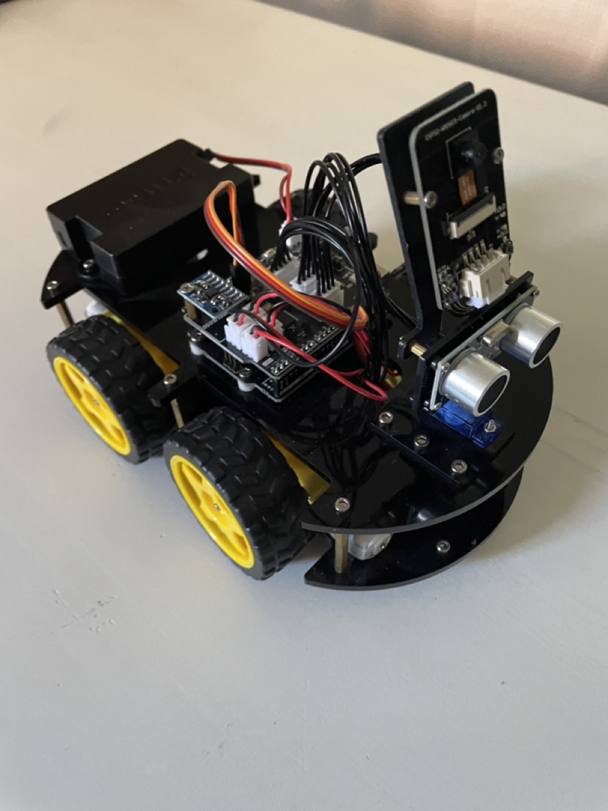
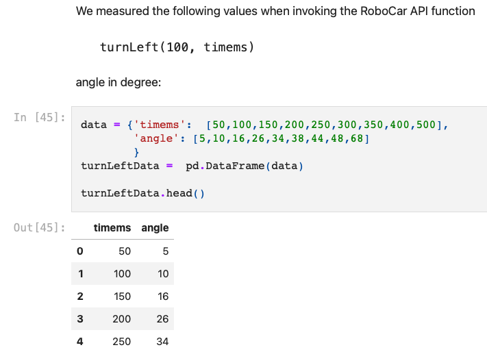
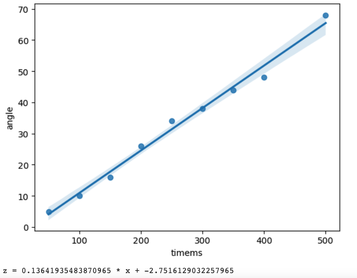
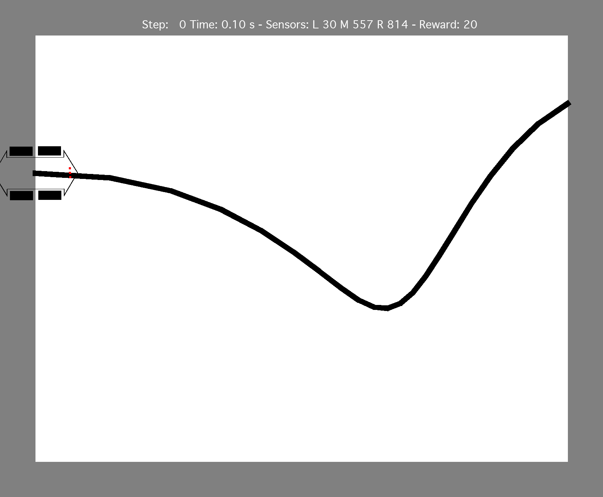
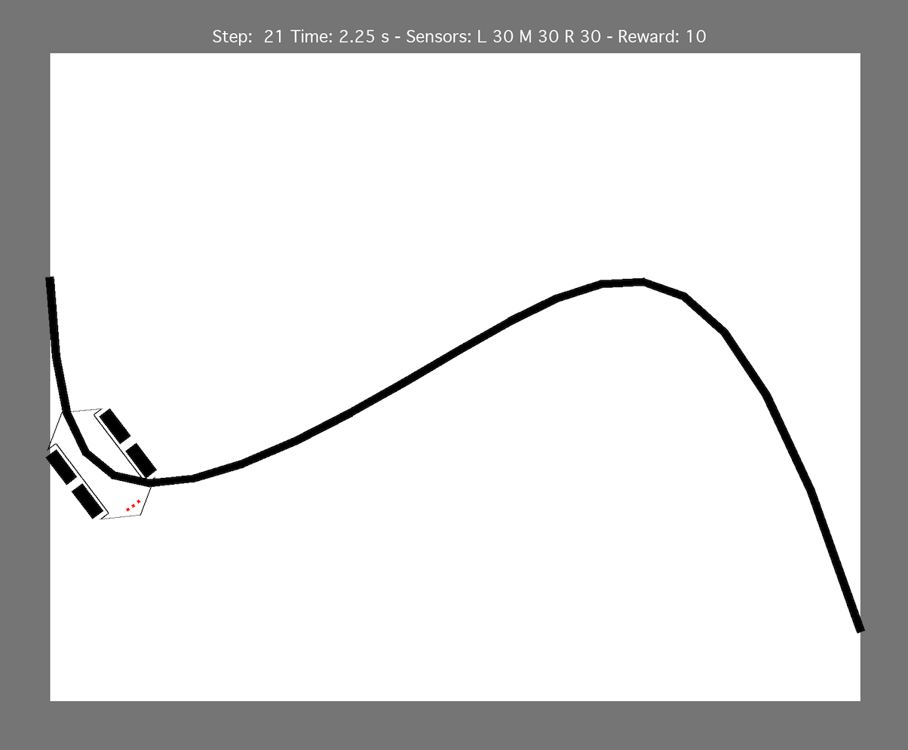
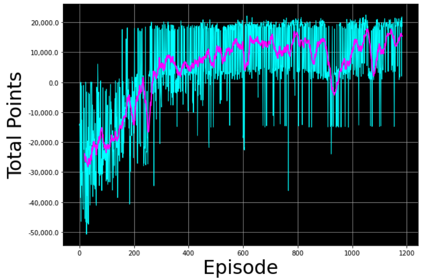
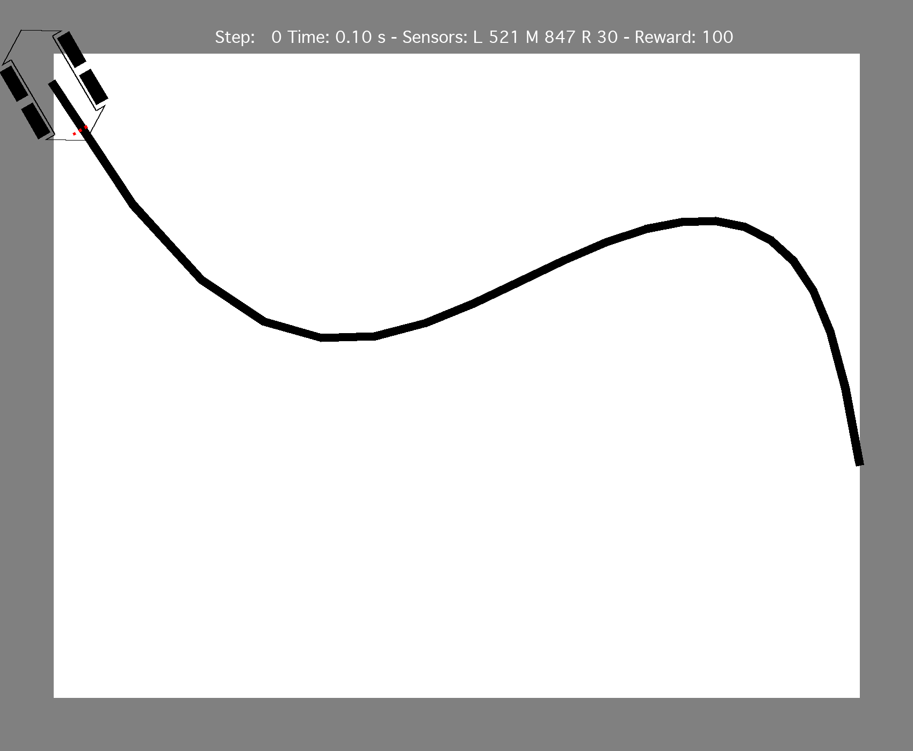
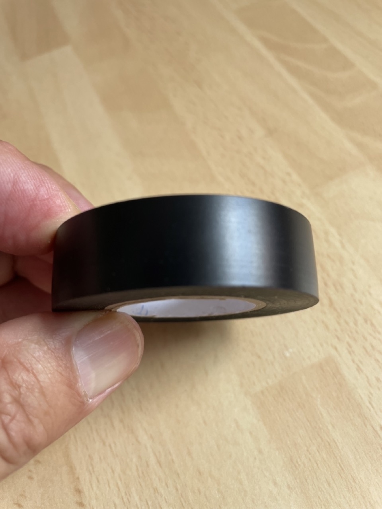

# CarSimulator
Car simulator to try reinforcement learning of line tracking with Arduino Robo Car




## Lessons learned from playing with reinforcement models

### TLDR

- real life experiments take time and it is worthwhile to create a digital twin of your setup (simulator)
- it is important to carefully consider a good reward function
- a good visualization of the steps taken by the model is essential to understand where the model still fails
- it is important to provide enough state to the model that it can achieve its goal
- when a model works fine in simulation it still may have problems in real life because in real life sensor values have a lot of variation and noise 
- hyperparameter tuning is more an art than a science

### Creating a simulator

Conduct some experiment in real life to collect some numeric measurements of how actions/steps result in state changes.

You can then extrapolate from the measurements using simple statistics like linear regression to derive 
the mathematical formulas needed for your simulator's modeling:

In this example I collected different values for left rotation with different time intervals



and then used python statistics and visualization packages to create the formulas:

```
import matplotlib.pyplot as plot
import seaborn as sb
import pandas as pd
import numpy as np
...
p=sb.regplot(turnLeftData.timems,turnLeftData.angle)
plot.show()
x = p.get_lines()[0].get_xdata()
y = p.get_lines()[0].get_ydata()
a, b = np.polyfit(x, y, 1)
print ("z = {} * x + {}".format(a, b))
```



for more details see https://github.com/Bodobolero/CarSimulator/blob/main/Measurements.ipynb

### A good reward function

My initial reward function rewarded the car when a sensor was on the line after a step. The most reliable way to achieve that was by staying in the same position but just repeatedly turn left and right with the nose without moving:


After I modified the reward function to not provide any rewards on a position that was already reached previously the model learned that when it lost the line, the most reliable way to go back to the line was to always turn left until it reached the line again - however this caused the model to turn halfway and run back to the starting point:



I tried different things like
- keeping a history of prior positions (and not reward for prior positions)
- increasing the reward for increasing x values

However by only tuning the reward function I could not achieve the goal.

### A good visualization helps debugging

I generated an animated gif where each model step was a frame. By stepping through the .gif (with Macos Preview) I could exactly understand where the model failed and what the problem was, as in this example where all sensors where off the line
and even a human being could not decide what to do now (turn left or right) without additional context:




### Hyperparameter tuning and when to stop learning

Learning rate, soft update, experience replay and hyperparameters heavily influenced how quickly the
model converged and for some combinations the model oscillated around sub-optimal solutions.
Tuning these parameters is an error prone and time consuming process.
When changing the reward function the achievable total return of the model changed significantly and it
was thus hard to decide when to terminate the learning loop.

I ended up with the following hyperparameters by experiment
```
GAMMA = 0.995             # discount factor
ALPHA = 1e-2              # learning rate  
TAU = 1e-2                # soft update
NUM_STEPS_FOR_UPDATE = 4  # perform a learning update every C time steps
STEPS_SENSOR_HISTORY = 2
MEMORY_SIZE = 10_000     # size of memory buffer
MINIBATCH_SIZE = 64   # mini-batch size
E_DECAY = 0.995       # ε decay rate for ε-greedy policy
E_MIN = 0.01          # minimum ε value for ε-greedy policy
```

I made the decision when to stop the learning loop based on a visual representation of the total reward history




for details see https://github.com/Bodobolero/CarSimulator/blob/main/LearnModel.ipynb

### Enough state relevant for the goal

With a single time point of sensor values even a human being could not decide what to do when the car has already left the line. Without knowing the relative position to the line you can not reliably decide whether to turn left or right.

However by providing the sensor values of two prio steps in addition the model had enough state to decide
if it previously left the line on the left or on the right and in which direction to turn.

So garbage in -> garbage out. If you do not provide enough state the model can not copy with all situations.

After adding a sensor history of two time steps to the state tensor the model suddenly worked well:



### Model optimized in simulation may still fail in real ife

My simulator did not correctly simulate different and complex ligthing conditions:

In the simulator
- the line always had the same width
- the line was always completely black
- the canvas was always completely white
- the same movement always caused the same delta x and delta y

In real life
- where the tape makes a curve the line may narrower than the specified width
- the line has a reflective surface causing wide variation in sensor values when the sensor is over the line

- the sensor was not completely flat (white table cloth) and this caused some shadows with different sensor values
- the car sometimes slipped on the surface causing different delta x and delty y

Finally I got it working by adding a (programmatic, not learned) calibration step that adjusts the sensor values to the
current lighting conditions and feeds the "corrected" sensor values to the DQN model:


### Conclusions: 

- invest in a good digital twin/simulator, add some noise to the simulator's sensor values (weather conditions, lighting conditions, temperature variations etc.)
- provide enough state to the model that it can realistically make a right decision
- tune your reward function and your state rather than wasting too much time in hyperparameter tuning
- early on test your models in real life to verify your simulation includes all relevant environmental parameters

